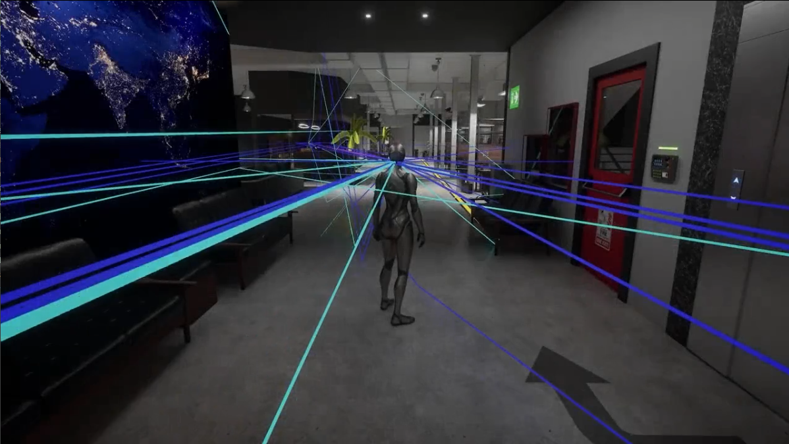
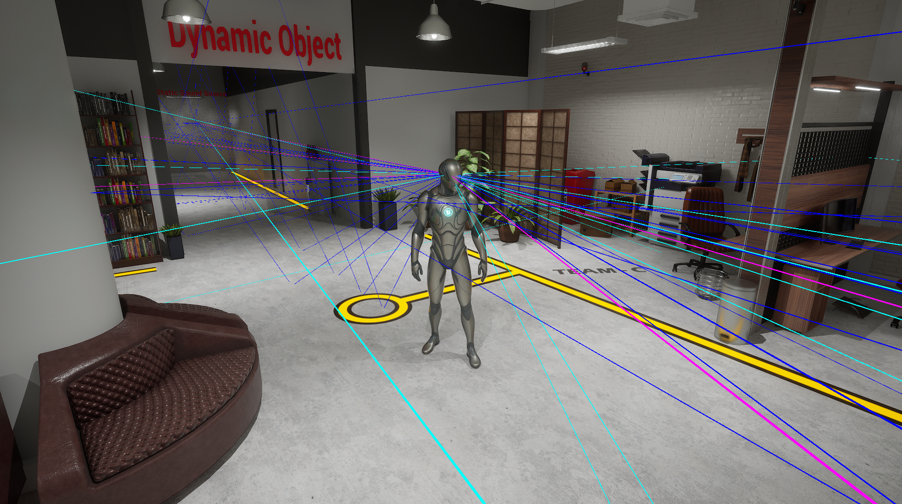
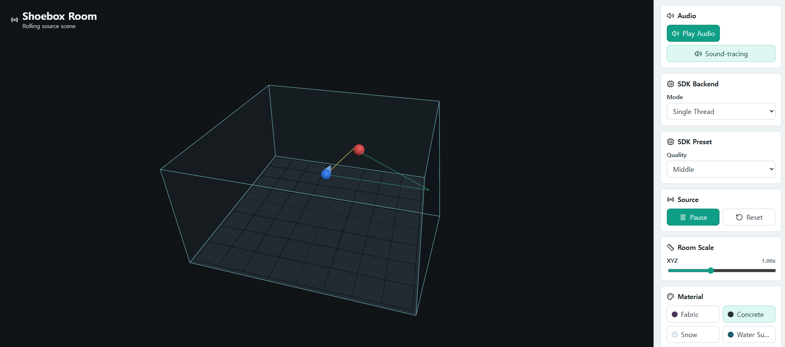
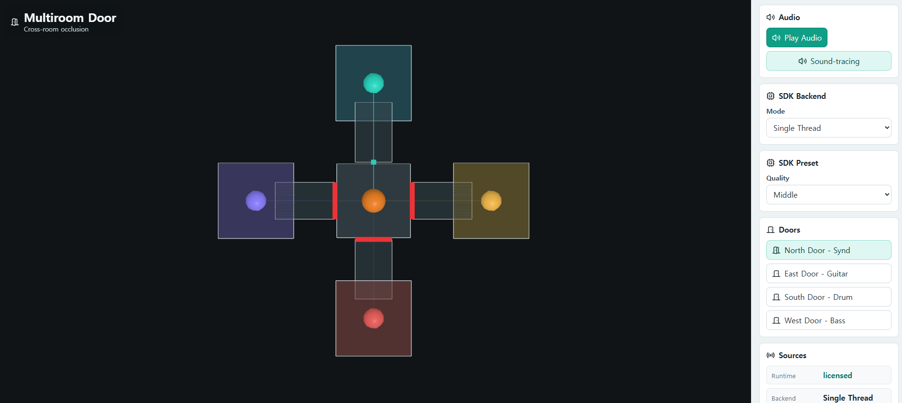
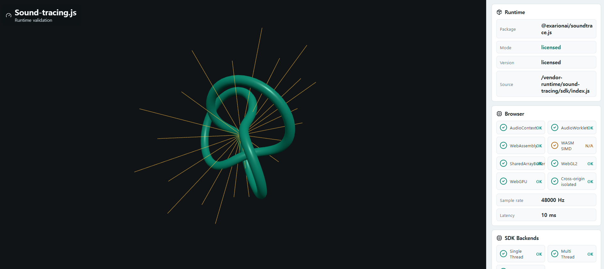

# Sound-tracing.js Demo

> Browser-based real-time sound-propagation and spatial-audio demo for visualizing direct sound, reflection, diffraction, occlusion, and listener-dependent acoustic changes.

[](https://react.dev/)
[](https://vite.dev/)
[](https://threejs.org/)
[](https://developer.mozilla.org/docs/Web/API/Web_Audio_API)
[](https://webassembly.org/)

**Sound-tracing.js Demo** is a public technical showcase for the licensed **Sound-tracing.js** browser SDK. It demonstrates how geometry, materials, sound-source movement, listener position, and dynamic objects affect audible sound in an interactive 3D scene.

The application is built with React, Vite, Three.js, the Web Audio API, and an optional WebAssembly runtime. It is intended for technical demonstration, partner evaluation, and SDK promotion rather than full architectural-acoustics certification.

This repository contains:

- Public demo application and example scenes
- Browser capability and runtime diagnostics
- Visualization components for acoustic propagation paths
- Media assets, screenshots, and demo documentation
- A public stub runtime for UI development
- Integration points for a separately distributed licensed WASM SDK

The production acoustic engine, optimized WASM binaries, proprietary material data, and commercial SDK are distributed separately through an evaluation or licensed channel.

---

## Demo

- **Live Demo:** [https://exarion.ai/demos/sound-tracing/](https://exarion.ai/demos/sound-tracing/)
- **Runtime Capability:** [Open demo](https://exarion.ai/demos/sound-tracing/#/examples/capability)
- **Shoe-box Room:** [Open demo](https://exarion.ai/demos/sound-tracing/#/examples/shoebox)
- **Multi-room Occlusion:** [Open demo](https://exarion.ai/demos/sound-tracing/#/examples/multiroom)

### Recommended Browser

Google Chrome is the recommended browser for public demonstrations and customer-facing evaluation.

| Environment | Status | Notes |
| --- | --- | --- |
| Windows desktop | Tested | Recommended for local technical demos |
| macOS desktop | Tested | Supported for local technical demos |
| Linux desktop | Tested | Supported for development and technical demos |
| Chrome browser | Recommended | Primary browser target for stable demonstrations |
| Safari browser | Limited | Long-running processing may be interrupted by browser resource-management policies |

For customer support and repeatable demonstrations, use a recent desktop version of Chrome with hardware acceleration enabled.

### Demo Video

[](https://www.youtube.com/watch?v=w0ntZ14Vxws)

Recommended video sequence:

1. Dry audio and Sound-tracing output comparison
2. Listener movement and left/right balance change
3. Sound-source movement and spatial-position change
4. Acoustic material change and resulting timbre change
5. Reflection and reverberation on/off comparison
6. Dynamic-object movement and real-time acoustic response
7. Door occlusion and multi-room transition
8. Runtime capability and latency diagnostics

---

## Core Demonstration Scenarios

### 1. Listener Position and Spatial Balance

Move the listener through the scene and hear the left/right balance, propagation delay, attenuation, and perceived direction change in real time.

### 2. Material-dependent Sound Change

Change wall, floor, ceiling, or object materials and compare changes in absorption, reflection, scattering, and perceived timbre.

### 3. Reflection and Reverberation

Enable or disable reflected paths and room response to compare direct-only sound with auralized output.

### 4. Dynamic Sound Source

Move a sound source while audio is playing and observe continuous changes in distance, direction, obstruction, and room response.

### 5. Dynamic Geometry

Move doors, barriers, and other scene objects and hear the effect of changing propagation paths without restarting the scene.

### 6. Multi-room Occlusion

Open or close a virtual door and compare direct, blocked, transmitted, and portal-based sound propagation between separated rooms.

---

## Acoustic Path Visualization

The visualizer can distinguish the main propagation-path categories used by the demo.

| Path Type | Description |
| --- | --- |
| **Direct Path** | Unobstructed path from a sound source to the listener |
| **Reflection Path** | One or more paths reflected by scene surfaces |
| **Diffraction Path** | Approximate path bending around detected edges or obstacles |
| **All Paths** | Combined visualization of active propagation-path categories |

Recommended visual conventions:

- Use a distinct line style or color for each path category
- Show active path count and path length in the diagnostics panel
- Allow users to enable or disable each path category independently
- Avoid rendering excessive path counts by applying distance, energy, depth, or visibility limits

---

## Screenshots

### Geometric Sound Propagation

<p align="center">
  
</p>

### Shoe-box Room Auralization

<p align="center">
  
</p>

### Multi-room Door Occlusion

<p align="center">
  
</p>

### Runtime Capability Panel

<p align="center">
  
</p>

---

## What the Demo Shows

- Geometry-aware direct sound propagation
- Real-time visualization of direct, reflected, and diffracted paths
- Distance attenuation and propagation delay
- Listener-dependent stereo and spatial balance
- Material-based absorption, reflection, and scattering parameters
- Early-reflection and simplified room-response rendering
- Dynamic sound sources and dynamic scene objects
- Door and wall occlusion behavior
- Portal-based multi-room sound transmission
- Browser-based auralization through the Web Audio API
- Optional WebAssembly acceleration for licensed runtime builds
- Browser, audio, graphics, and runtime diagnostics

A previous large-scene demonstration used approximately **148,048 static primitives**, **12 dynamic primitives**, **3 static sound sources**, and **1 dynamic sound source**. These values are presented as a reference demo scale, not as a guaranteed browser performance specification. Actual performance depends on the scene, path depth, device, browser, audio configuration, and licensed runtime build.

---

## Demo Routes

| Route | Description |
| --- | --- |
| `/examples/capability` | Checks browser audio, WebAssembly, SIMD, shared memory, graphics, and runtime capabilities |
| `/examples/shoebox` | Interactive 3D rectangular-room simulation with source, listener, materials, and reflection paths |
| `/examples/multiroom` | Demonstrates door openness, occlusion, transmission loss, and portal-based propagation between rooms |

### Runtime Capability Demo

Typical diagnostics include:

- `AudioContext` sample rate and state
- AudioWorklet availability
- WebAssembly availability
- WASM SIMD support
- `SharedArrayBuffer` availability
- WebGL or WebGPU capability
- Estimated audio latency
- Runtime load status
- Ray-tracing benchmark result
- Active source, primitive, and propagation-path counts
- Audio callback or render-drop statistics

### Shoe-box Room Demo

Typical interactions include:

- Change room width, depth, and height
- Move the sound source and listener
- Select wall, floor, and ceiling materials
- Adjust absorption and scattering coefficients
- Visualize direct, reflected, and diffracted paths
- Control dry/wet audio mix
- Compare bypass and auralized output
- Enable or disable reverberation
- Inspect RT60 and early-reflection metrics

### Multi-room Occlusion Demo

Typical interactions include:

- Open and close a virtual door
- Move the source and listener between rooms
- Visualize blocked, transmitted, and portal paths
- Apply distance- and obstruction-based attenuation
- Apply low-pass filtering for closed-door conditions
- Compare direct, occluded, and portal-based rendering

---

## Previous Demonstration Assets

Sound-tracing technology has also been demonstrated in several desktop, game-engine, VR, AR, automotive, and auditorium-style scenes. These assets can be used as references when expanding the public demo gallery.

| Demo Asset | Example Focus |
| --- | --- |
| Unreal plug-in demo | Real-time game-engine integration |
| SoundShooter VR | Interactive VR sound propagation |
| Automotive drag demo | Moving source/listener and vehicle-space acoustics |
| Dome and robot scene | Curved geometry and dynamic-object interaction |
| School VR scene | Large static scene, reflection, diffraction, and moving sources |
| Auditorium stage | Dense reflection paths and material comparison |
| AR scene | Mobile or mixed-reality sound-scene demonstration |

Repository maintainers should only publish legacy screenshots, videos, binaries, and links after confirming ownership, partner approval, and distribution rights.

---

## Cross-platform Demonstration Background

The Sound-tracing engine has been used in an **exaStudio sound-scene demonstration** built and tested across Linux, macOS, Windows, and web-browser environments. The demonstration was used to show:

- Cross-platform build stability
- Interactive sound-scene playback
- Material changes producing audible tonal differences
- Listener-position changes producing spatial differences
- Reusable demonstration assets for partner presentations

This browser repository focuses on presenting a subset of those concepts through a portable, accessible web experience.

---

## Runtime Distribution Model

The application supports multiple runtime modes so that the public demo can remain accessible without exposing the production acoustic engine.

| Mode | Description | Intended Use |
| --- | --- | --- |
| **Stub Runtime** | Keeps the UI and example flows operational without proprietary processing | Public repository, UI development, documentation |
| **JavaScript Demo Runtime** | Runs limited browser-side acoustic calculations | Lightweight interactive examples |
| **Limited WASM Runtime** | Provides restricted acceleration for selected scenarios | Technical evaluation |
| **Licensed WASM Runtime** | Loads the production Sound-tracing.js engine from a separately distributed SDK package | Commercial integration and partner projects |

When the licensed SDK is unavailable, the application automatically falls back to the public stub runtime. The fallback does not provide the full acoustic-processing capability of the production SDK.

> [!IMPORTANT]
> ## Request the Licensed SDK
>
> The **Licensed Sound-tracing.js SDK is distributed through a Request Form process** and is not included in this public repository.
>
> To request SDK access, an evaluation package, or integration information, send an email to **[contact@exarion.ai](mailto:contact@exarion.ai?subject=Sound-tracing.js%20Licensed%20SDK%20Request)**.
>
> Please include your organization, intended use case, target platform, and evaluation or integration purpose so that the appropriate SDK package and request procedure can be provided.

---

## Requirements

- Node.js 20 or newer
- npm 10 or newer
- Recent desktop Google Chrome recommended
- WebGL-capable GPU and hardware acceleration enabled
- Headphones recommended for spatial-audio evaluation
- Licensed SDK ZIP package for production WASM processing

---

## Getting Started

### 1. Clone the repository

```bash
git clone https://github.com/exarionAI/Sound-tracing.git
cd Sound-tracing
```

### 2. Install dependencies

```bash
npm install
```

### 3. Run with the public stub runtime

```bash
npm run dev
```

Open the URL printed by Vite, typically:

```text
http://localhost:5173/examples/capability
```

The stub runtime keeps the UI interactive but does not execute the licensed acoustic engine.

---

## Licensed SDK Setup

The licensed SDK is distributed separately through the **SDK Request Form process**. To request access, contact **[contact@exarion.ai](mailto:contact@exarion.ai?subject=Sound-tracing.js%20Licensed%20SDK%20Request)** before proceeding with the setup below.

After the request is reviewed, the licensed SDK is provided separately as a ZIP file, for example:

```text
vendor_sound-tracing.zip
```

The ZIP root contains an `sdk/` directory. Create `vendor/sound-tracing/` in the repository, then drag the extracted `sdk/` directory into it.

### Drag and drop (recommended)

```text
Sound-tracing/
└─ vendor/
   └─ sound-tracing/
      └─ sdk/
         ├─ index.js
         ├─ core/
         └─ assets/
```

The directory name `sound-tracing` is lowercase and must match exactly on case-sensitive filesystems. Do not place the licensed SDK under `public/vendor/`.

### Windows PowerShell

```powershell
New-Item -ItemType Directory -Path .\vendor\sound-tracing -Force
Expand-Archive .\vendor_sound-tracing.zip -DestinationPath .\vendor\sound-tracing -Force
```

### macOS or Linux

```bash
mkdir -p vendor/sound-tracing
unzip vendor_sound-tracing.zip -d vendor/sound-tracing
```

Verify that the following files are available:

```text
vendor/sound-tracing/sdk/index.js
vendor/sound-tracing/sdk/core/st/exaSound.wasm
vendor/sound-tracing/sdk/assets/soundMaterial.json
```

The application loads the licensed SDK from:

```text
/vendor-runtime/sound-tracing/sdk/index.js
```

The checked-in runtime manifest points to this fixed development URL. Vite serves `vendor/sound-tracing/` through that URL during local development and copies `vendor/sound-tracing/sdk/` into the production build automatically. No `.env.local` file or environment-variable setup is required.

> Do not commit licensed SDK files, WASM binaries, SDK ZIP files, or proprietary material databases to the public repository.

---

## Development Commands

```bash
npm run dev            # Start the Vite development server
npm run typecheck      # Run TypeScript checks
npm run test           # Run unit tests and the private-runtime guard
npm run build          # Create a production build
npm run preview        # Preview the production build locally
npm run test:e2e       # Run Playwright browser smoke tests
npm run check:private  # Verify that private runtime files are not tracked
```

### Build and Test

```bash
npm run typecheck
npm run test
npm run build
```

Preview the production build:

```bash
npm run preview
```

Then open:

```text
http://127.0.0.1:4173/examples/capability
```

Optional Playwright smoke test setup:

```bash
npx playwright install chromium
npm run test:e2e
```

---

## Project Structure

```text
Sound-tracing/
├─ vendor/
│  └─ sound-tracing/
│     └─ sdk/                 # Local licensed SDK; ignored by Git
├─ public/
│  ├─ media/
│  │  ├─ screenshots/
│  │  ├─ videos/
│  │  └─ audio-samples/
│  └─ vendor/
│     └─ sound-tracing/
│        └─ runtime-manifest.json
├─ scripts/
├─ src/
│  ├─ app/
│  ├─ components/
│  ├─ examples/
│  │  ├─ capability-check/
│  │  ├─ shoebox-room/
│  │  └─ multiroom-door/
│  ├─ integration/
│  ├─ mock/
│  └─ visualizers/
├─ tests/
├─ docs/
│  ├─ getting-started.md
│  ├─ api-reference.md
│  ├─ sdk-integration-guide.md
│  ├─ runtime-modes.md
│  ├─ technical-overview.md
│  ├─ licensing.md
│  └─ faq.md
├─ package.json
├─ vite.config.ts
└─ README.md
```

Recommended media structure:

```text
public/media/
├─ screenshots/
│  ├─ demo-video-thumbnail.png
│  ├─ ray-tracing-visualization.png
│  ├─ shoebox-room-simulator.png
│  ├─ multiroom-door-occlusion.png
│  └─ runtime-capability-panel.png
├─ videos/
│  └─ sound-tracing-demo.mp4
└─ audio-samples/
   ├─ dry-source.wav
   ├─ shoebox-rendered.wav
   └─ door-occlusion-demo.wav
```

---

## Technology and Research Background

The reference material identifies an intellectual-property portfolio covering Sound-tracing core architecture, multi-core expansion, propagation-performance improvement, and real-time diffraction. It also cites academic work on real-time sound-propagation hardware and mobile-device performance optimization.

Representative items include:

- **US 11,924,626** — *Sound Tracing Apparatus and Method*
- **US 12,101,619** — *Sound Tracing Method and Device to Improve Sound Propagation Performance*
- **KR 10-1955552** — Sound-tracing core and system architecture
- **KR 10-2226120** — Multi-core Sound-tracing apparatus and method
- **KR 10-2620729** — Edge-detection method and apparatus for real-time diffraction
- **SIGGRAPH Asia 2023 Technical Paper** — *An Architecture and Implementation of Real-Time Sound Propagation Hardware for Mobile Devices*
- Eunjae Kim et al., *Multi-Threaded Sound Propagation Algorithm to Improve Performance on Mobile Devices*, Sensors, 2023
- Eunjae Kim et al., *Effective Algorithm to Control Depth Level for Performance Improvement of Sound Tracing*, Journal of Web Engineering, 2022

Patent status, portfolio counts, and publication links should be verified against official records before being used in external marketing, licensing, investment, or legal materials.

---

## Deployment

The demo can be deployed as a static web application using:

- GitHub Pages
- Vercel
- Netlify
- Cloudflare Pages
- An internal static web server

The repository includes a GitHub Actions workflow that publishes the public stub build to GitHub Pages. The separately distributed licensed SDK under `vendor/sound-tracing/sdk/` is excluded from this artifact.

For GitHub Free, make the repository public and select **Settings → Pages → Source → GitHub Actions** once before running the workflow. Pushes to `dev` then deploy the site automatically.

Recommended deployment sequence:

1. Run type checks and tests
2. Build the Vite application
3. Publish the generated static assets
4. Validate route handling and base paths
5. Confirm media and audio asset paths
6. Confirm whether the deployment uses the stub or licensed runtime
7. Run Chrome-based smoke tests against the deployed site
8. Perform a continuous-playback test to detect audio interruption, memory growth, and render degradation

---

## Intended Audience

- Acoustic simulation engineers
- Spatial-audio developers
- Web Audio API developers
- Digital-twin and simulation platform teams
- Game, XR, AR, and virtual-environment developers
- Automotive and smart-device audio teams
- Technical partners evaluating SDK integration
- Product teams reviewing browser-based acoustic experiences

---

## Potential Applications

- Interactive room-acoustic previews
- Spatial-audio prototyping
- Digital-twin sound-propagation visualization
- Game and XR acoustic simulation
- Automotive cabin and moving-source demonstrations
- Door, wall, and room-separation demonstrations
- Browser-based education for geometric acoustics
- Technical evaluation before commercial SDK integration

---

## Security and Repository Policy

The following files must remain outside public source control:

- Licensed SDK packages
- Production WASM binaries
- Proprietary material databases
- Private keys or access tokens
- Customer-specific scene data
- Commercial integration examples covered by NDA
- Partner demonstration assets without explicit publication approval

Before publishing changes, run:

```bash
npm run check:private
```

Also review the Git index directly:

```bash
git status
git ls-files vendor
```

---

## Evaluation and Commercial Integration

Evaluation runtime access, licensed WASM packages, SDK integration support, and technical partnership discussions are handled separately from this public demo repository through a **Request Form process**.

For SDK requests and related inquiries, contact:

- **Licensed SDK Request:** [contact@exarion.ai](mailto:contact@exarion.ai?subject=Sound-tracing.js%20Licensed%20SDK%20Request)
- **Evaluation and Integration Inquiry:** [contact@exarion.ai](mailto:contact@exarion.ai?subject=Sound-tracing.js%20Evaluation%20or%20Integration%20Inquiry)

When contacting EXARION, include your organization, intended application, target platform, and expected evaluation or deployment scope.

---

## Notice

This repository is a demonstration and example project for presenting the concepts and capabilities of **Sound-tracing.js**.

The full production runtime, high-performance WASM package, commercial SDK, proprietary material data, and internal acoustic optimization logic may be distributed separately under an evaluation agreement, commercial license, or partner agreement.
